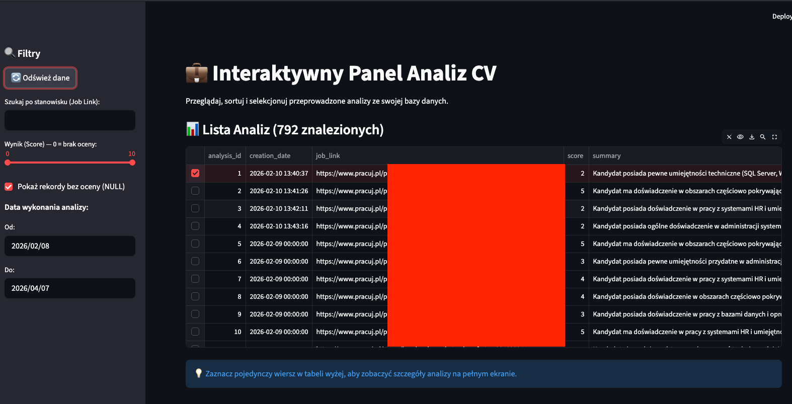
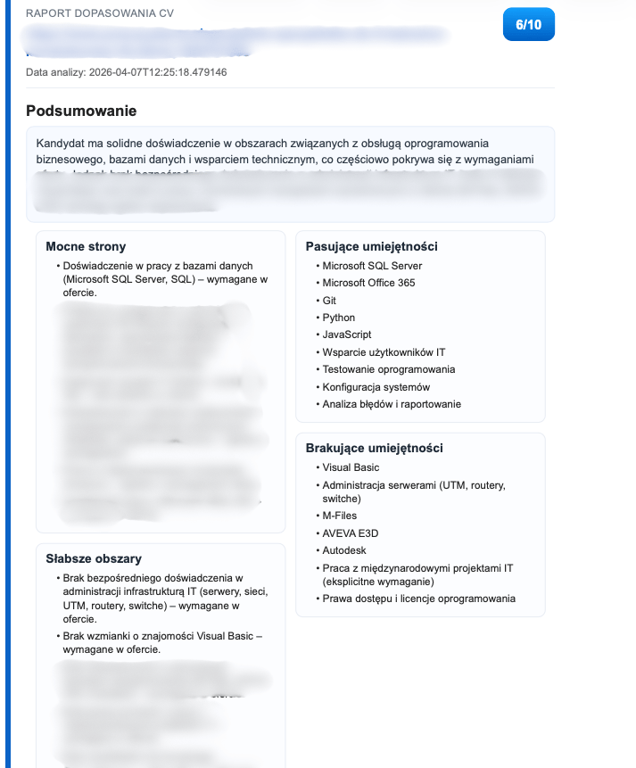

# Jobs-Link-Profile_LI_Analyze

Projekt automatyzuje analizę dopasowania CV do ofert pracy z użyciem lokalnych modeli Ollama na podstawie zrzutu ekranu wykonanego z doświadczenia linkedin jako cv. Jest to rozszerzenie projektu bazowego Jobs-alert-discord-IT i korzysta z jego bazy ofert.

## Relacja do projektu bazowego

To repozytorium zakłada, że masz dane ofert w bazie discord_bot.db generowanej przez:
https://github.com/akowynia/Jobs-alert-discord-IT

Bez tej bazy analiza ofert nie będzie działać.

## Co robi projekt

- pobiera oferty pracy z discord_bot.db
- czyści treść stron ofert (cloudscraper + BeautifulSoup)
- **fallback do Playwright** dla stron wymagających renderowania JavaScript lub blokujących boty
- porównuje CV (output.txt) z ofertą przez Ollama
- **interaktywne menu** z wieloma trybami analizy (dzisiejsze, zakres dat, manualne)
- zapisuje wyniki do cv_analysis.db i folderu `analyses_txt/`
- udostępnia dashboard Streamlit
- generuje raport PDF z analiz
- wspiera import historycznych analiz z plików txt

## Szybki start

1. Utwórz i aktywuj środowisko:

```bash
python -m venv .venv
source .venv/bin/activate
```

2. Zainstaluj zależności:

```bash
pip install -r requirements.txt
# Opcjonalnie zainstaluj Playwright dla lepszego scrapowania:
pip install playwright
playwright install chromium
```

3. Uruchom Ollama i pobierz modele:

```bash
ollama pull ministral-3:8b
# lub inny model, którego chcesz używać
```
4. Wykonaj zrzut ekranu sekcji doświadczenia z LinkedIn: https://www.linkedin.com/in/twoje-linkedin-id/details/experience/

	Najwygodniej użyć rozszerzenia GoFullPage albo zwykłego narzędzia do zrzutów ekranu. Zapisz plik jako `image.png` w katalogu głównym projektu, a potem uruchom:

	```bash
	python LinkedInExtractor.py
	```

5. Upewnij się, że masz:
- discord_bot.db z projektu bazowego
- output.txt z treścią z poprzedniego kroku.

6. Uruchom analizator:

```bash
python main.py
```

## Przepływ pracy end-to-end

1. Jobs-alert-discord-IT zapisuje oferty do discord_bot.db.
2. main.py wyświetla interaktywne menu pozwalające na wybór ofert (np. z dzisiaj, z ostatnich X dni, manualne linki).
3. Dla każdej oferty pobierana i czyszczona jest treść strony (z użyciem Playwright jeśli to konieczne).
4. Ollama zwraca JSON z oceną i szczegółami dopasowania.
5. Wynik trafia do cv_analysis.db oraz do folderu `analyses_txt/`.
6. Wyniki można przeglądać w dashboard.py lub eksportować przez pdf_create.py.

## Uruchamianie modułów

### Główny analizator (main.py)

Program posiada interaktywne menu:
1. **Analiza ofert z dzisiaj** – automatycznie pobiera oferty z bazy `discord_bot.db`.
2. **Analiza z przedziału czasowego** – pyta o datę początkową i końcową.
3. **Analiza z ostatnich X dni** – pozwala szybko sprawdzić oferty np. z ostatniego tygodnia.
4. **Statystyki** – pokazuje podsumowanie wszystkich analiz w bazie.
5. **Najlepsze dopasowania** – wyświetla oferty z oceną >= 5/10.
6. **Pojedynczy link** – pozwala ręcznie podać URL do oferty.
7. **Ręczny tekst** – pozwala wkleić treść oferty bezpośrednio do konsoli (użyteczne przy kopiowaniu z maila/portali).

Obsługa argumentów CLI:
```bash
python main.py --model nazwa_modelu # np. --model ministral-3:8b
```

### Dashboard (Streamlit)

Interaktywny widok wszystkich analiz:
```bash
streamlit run dashboard.py
```

### Generowanie PDF

Tworzy czytelny raport z najlepszych dopasowań:
```bash
python pdf_create.py
```

### Ekstrakcja danych LinkedIn

Przetwarza zrzut ekranu `image.png` na `output.txt`:
```bash
python LinkedInExtractor.py
```

## Zrzuty ekranu

Dashboard:



Przykład wygenerowanego raportu PDF:




## Testy

Instalacja zależności developerskich:

```bash
pip install -r requirements-dev.txt
```

Uruchomienie testów:

```bash
pytest
```

Zakres testów:
- unit: parser JSON i logika detekcji pętli
- integration: główny analizator z mockami Ollama/HTTP/SQLite oraz PDF z mockiem WeasyPrint

## Uwagi dla macOS (WeasyPrint)

Jeśli generowanie PDF zwraca błąd bibliotek systemowych GTK/Pango (np. libgobject), doinstaluj wymagane biblioteki systemowe, bo to problem środowiska, nie logiki kodu.
